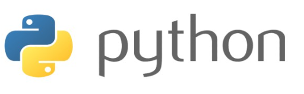

# Git 특강 1일차 정리

# 1. CLI

GUI와 CLI의 정의

1. `GUI (Graphic User Interface)` : 그래픽을 통해 사용자와 컴퓨터가 상호 작용하는 방식
2. `CLI (Command Line Interface)` : 터미널을 통해 사용자와 컴퓨터가 상호 작용하는 방식

> Interface(인터페이스) 인터페이스란 원래 서로 다른 개체끼리 맞닿아 있는 면을 뜻합니다. 여기에서는 사용자와 컴퓨터가 서로 소통하는 접점이라고 이해하도록 합시다

## 경로

### (1) 루트, 홈 디렉토리

1. **루트 디렉토리 (Root Directory, `/`)**
   - 모든 파일과 폴더를 담고 있는 최상위 폴더입니다.
   - Windows의 경우 보통은 `C 드라이브`를 의미합니다.
2. **홈 디렉토리 (Home Directory, `~`)**
   - `Tilde(틸드)`라고도 부르며, 현재 로그인 된 사용자의 홈 폴더를 의미합니다.
   - Windows의 경우 `C:/사용자(Users)/현재 사용자 계정`을 의미합니다.
   - Mac의 경우 `/Users/현재 사용자 계정`을 의미합니다.

> 💡 **폴더 vs 디렉토리**

> 폴더와 디렉토리는 거의 같은 의미로 사용됩니다. 따라서 의미의 구분이 무의미합니다. 세부적으로 따져보자면, 윈도우 탐색기에서의 특수 폴더 들(ex. 네트워크 환경, 내컴퓨터 등)은 폴더이지만 디렉토리는 아닙니다. 따라서 폴더가 디렉토리보다 넓은 개념이라고 할 수는 있겠습니다.

</aside>

### (2) 절대 경로와 상대 경로

1. 절대 경로

    : 루트 디렉토리부터 목적 지점까지 거치는 모든 경로를 전부 작성한 것

   - 윈도우 바탕 화면의 절대 경로 `C:/Users/kyle/Desktop`

2. 상대 경로

    : 현재 작업하고 있는 디렉토리를 기준으로 계산된 상대적 위치를 작성한 것

   - 현재 작업하고 있는 디렉토리가 `C:/Users` 라고 한다면
   - 윈도우 바탕 화면으로의 상대 경로는 `kyle/Desktop` 이 됩니다.
   - 간결해서 좋지만, 현재 작업하고 있는 디렉토리가 변경 되면 상대 경로도 변경됩니다.
   - `./` : 현재 작업하고 있는 폴더를 의미합니다.
   - `../` : 현재 작업하고 있는 폴더의 부모 폴더를 의미합니다.

# 2. Visual Studio Code

> Visual Studio Code 왜 쓰나요? - Vscode는 마이크로소프트에서 개발한 코드 에디터의 한 종류입니다. - Windows, Mac, Linux를 모두 지원합니다. - 기존 개발 도구들 보다 가볍고 빠르다는 장점이 있습니다. - 전 세계에서 사랑 받는 굉장한 점유율의 에디터입니다. - Extension을 통해 다양한 기능을 설치할 수 있어서, 무한한 확장성을 가집니다. - 게다가 무료로 사용 가능합니다.

### Extensions란?

- `익스텐션`이란 기본 기능에서 확장하여 추가적인 기능을 가능하게 하는 일종의 `플러그인`입니다.

- vscode를 열고 왼쪽 메뉴바에서 `블럭 모양의 아이콘`을 통해 익스텐션 창을 열 수 있습니다.

  > 처음부터 모든 기능을 갖추면 되지, 왜 익스텐션을 쓰나요? 
  >
  > 물론, 처음부터 모든 기능을 갖춘다면 일일히 익스텐션을 설치 하지 않아도 될 것입니다. 하지만 그만큼 불필요한 기능도 많아서 필요 이상으로 에디터가 무거워집니다. vscode는 사용자가 필요한 기능을 익스텐션을 통해 추가 설치 할 수 있도록 지원하여 가벼우면서도 다양한 작업을 할 수 있는 환경을 제공하고 있습니다.

# 3. Makedown 배우기


제목(headings) #의 갯수
# 제목1
## 제목2
### 제목3
#### 제목4
##### 제목5
###### 제목6

2. 순서 (list)
- 순서가 없는 목록1
- 순서가 없는 목록2
  - 서브 목록 1
  - 서브 목록 2
    - 서브 서브 목록 1

1. 순서가 있는 목록1
2. 순서가 있는 목록2
   1. 서브 목록1
      1. 서브 서브 목록1

3. 강조

- 기울임 : *글자* _글자_   글자 앞뒤로 *,_

  - 굵게 : **글자** __글자__  글자 앞뒤로 *,_ 2개씩

    - 취소 : ~~글자~~  글자 앞뒤로 ~2개씩


      4. 소스 코드
      - 한 줄 코드 (인라인 코드)

        `print("Hello world!")`


      - 여러 줄 코드 (블록 코드)

        ```python
        for i in range(10):
        	print(i)
        ```

      5. 표 (table)

         | 동물 이름 | 다리 개수 | 종     |
         | --------- | --------- | ------ |
         | 사자      | 4개       | 포유류 |
         | 토끼      | 4개       | 포유류 |
         | 앵무새    | 2개       | 조류   |
         |           |           |        |


      6. 수평선
      -, *, _ 세번 이상 반복하면 가능하다. 

# 실습


#  Python


## 1. 개요



![image]

파이썬(Python)은 1990년 암스테르담의 귀도 반 로섬(Guido Van Rossum)이 개발한 인터프리터 언어이다. 귀도는 파이썬이라는 이름을 자신이 좋아하는 코미디 쇼인 "몬티 파이썬의 날아다니는 서커스(Monty Python’s Flying Circus)"에서 따왔다고 한다.

> 인터프리터 언어란 한 줄씩 소스 코드를 해석해서 그때그때 실행해 결과를 바로 확인할 수 있는 언어이다.


## 2. 특징

1. 파이썬은 인간다운 언어이다. 아래 코드는 쉽게 해석된다.

​	`if 4 in [1,2,3,4]: print("4가 있습니다")`

​	만약 4가 1, 2, 3, 4 중에 있으면 "4가 있습니다"를 출력한다. 라고 말이다.

 	2. **파이썬은 간결하다**

``` python
#simple.py
languages = ['python', 'perl', 'c', 'java']

for lang in languages:
	if lang in ['python', 'perl']:
		print("%6s need interpreter" % lang)
	elif lang in ['c', 'java']:
		print("%6s need compiler" % lang)
	else:
		print("should not reach here")
```

3. 공식문서가 자세히 제공된다.

   [파이썬 공식문서 링크](https://docs.python.org/3/)


# 4. Git 기초


## 	1. Git 환경설정 (최초 1번만 하면 됨)

​		git config --global user.name edukyle
​		git config --global user.email edukyle.hphk@gmail.com

​		git config --global --list


## 	2. git 로컬 저장소 만들기

​		git init


## 	3. git 파일 상태 보기

​		git status


## 	4.  Working Directory -> Staging Area

​		git add a.txt

​		Staging Area -> Commits
​		git commit -m "commit message"


## 	5. git 커밋 목록 보기

​		git log
​		git log --oneline
​		git log -p


# 5. Github


