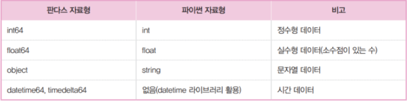
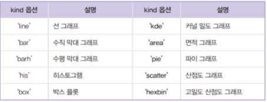
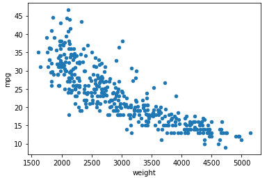
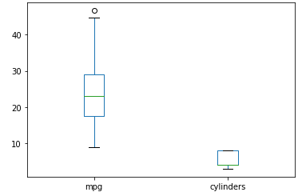

# Today I Learned

## 판다스(Pandas)

> #### 인덱스 활용

- 행 인덱스 재배열
  - 새로운 배열로 행 인덱스를 재지정 : DataFrame 객체.reindex(새로운 인덱스 배열)

- 행 인덱스 초기화
  - 정수형 위치 인덱스로 초기화 : DataFrame 객체.reset_index()
- 행 인덱스를 기준으로 데이터 프레임 정렬
  - 행 인덱스 기준 정렬 : DataFrame 객체.sort_index()
- 열 기준으로 데이터프레임 정렬
  - 열 기준 정렬 : DataFrame 객체.sort_values()
- 시리즈 vs 숫자
  - 시리즈와 숫자 연산 : Series객체 + 연산자(+,-,*,/) + 숫자
- 시리즈 vs 시리즈
  - 시리즈와 시리즈 연산 : Series1 + 연산자(+,-,*,/) + Series2
- 연산 메소드
  - 연산 메소드 사용(시리즈와 시리즈 덧셈): Series1.add(series2, fill_value=0)
- 데이터프레임 vs 숫자
  - 데이터프레임과 숫자 연산 : DataFrame 객체 + 연산자(+,-,*,/) + 숫자
- 데이터프레임 vs 데이터프레임
  - 데이터프레임의 연산자 활용 : DataFrame1 + 연산자(+,-,*,/) + DataFrame2


## 데이터 입출력

> #### 외부 파일 읽어오기

- File Format
  - CSV
  - JSON
  - HTML
  - Local clipboard
  - MS Excel
  - HDF Format
  - SQL
- Reader
  - read_csv
  - read_json
  - read_html
  - read_clipboard
  - read_excel
  - read_hdf
  - read_sql
- Writer
  - to_csv
  - to_json
  - to_html
  - to_clipboard
  - to_excel
  - to_hdf
  - to_sql
- CSV 파일 -> 데이터프레임 : pandas.read_csv("파일 경로(이름)")
- Excel 파일 -> 데이터프레임 : pandas.read_excel("파일 경로(이름)")
- JSON 파일 -> 데이터프레임 : pandas.read_json("파일 경로(이름)")
- 웹(WEB)에서 가져오기
  - HTML 표 속성 읽기 : pandas.read_html("웹 주소(URL)" 또는 "HTML 파일 경로(이름)")

## 데이터 살펴보기

> #### 데이터 내용

- 속성, 데이터 상세(범위)

  - mpg : 연비, 연속값
  - cylinders : 실린더 수, 이산 값
  - displacement : 배기량, 연속 값
  - horsepower : 출력, 연속 값
  - weight : 차중, 연속 값
  - acceieration : 가속능력, 연속 값
  - model_year : 출시년도, 이산 값
  - origin : 제조국, 이산 값
  - name : 모델명, 문자열

- 데이터프레임의 크기(행, 열)

  - 데이터프레임의 크기 확인 : DataFrame 객체.shape
  - 데이터 프레임의 기본 정보 : DataFrame 객체.info()
  - 데이터프레임의 크기(행, 열) 
  - 데이터프레임의 기술 통계 정보 요약 : DataFrame 객체.describe()
  - 각열 데이터 개수 확인 : DataFrame 객체.count()
  - 열 데이터의 고유값 개수 : DataFrame 객체["열 이름"].value_counts()
  - 모든 열의 평균값 : DataFrame 객체.mean()
  - 특정 열의 평균값 : DataFrame 객체["열 이름"].mean()
  - 모든 열의 중간값 : DataFrame 객체.median()
  - 특정 열의 중간값 : DataFrame 객체["열 이름"].median()
  - 모든 열의 최대값 : DataFrame 객체.max()
  - 특정 열의 최대값 : DataFrame 객체["열 이름"].max()
  - 모든 열의 최솟값 : DataFrame 객체.min()
  - 특정 열의 최솟값 : DataFrame 객체["열 이름"].min()
  - 모든 열의 표준편차 : DataFrame 객체.std()
  - 특정 열의 표준편차 : DataFrame 객체["열 이름"].std()
  - 모든 열의 상관계수 : DataFrame 객체.corr()
  - 특정 열의 상관계수 : DataFrame 객체[열 이름의 리스트].corr()

  ## 판다스 내장 그래프 도구 활용

> #### 내장 Plot( ) 메소드



- 선 그래프 : DataFrame 객체.plot()

- 막대 그래프 : DataFrame 객체.plot(kind='bar')

- 히스토그램 : DataFrame 객체.plot(kind='hist')

- 산점도

  ```python
  df = pd.read_csv(r'C:\Users\동동아\Desktop\동희box\빅데이터수업\jupyter_Notebook\auto-mpg.csv', header=None)
  df.columns = ['mpg','cylinders','displacement','horsepower','weight','acceleration','model year','origin','name']
  df.plot(x='weight', y='mpg', kind='scatter')
  ```



- 박스플롯

```python
df = pd.read_csv(r'C:\Users\동동아\Desktop\동희box\빅데이터수업\jupyter_Notebook\auto-mpg.csv', header=None)
df.columns = ['mpg','cylinders','displacement','horsepower','weight','acceleration','model year','origin','name']
df[['mpg','cylinders']].plot(kind='box')
```

