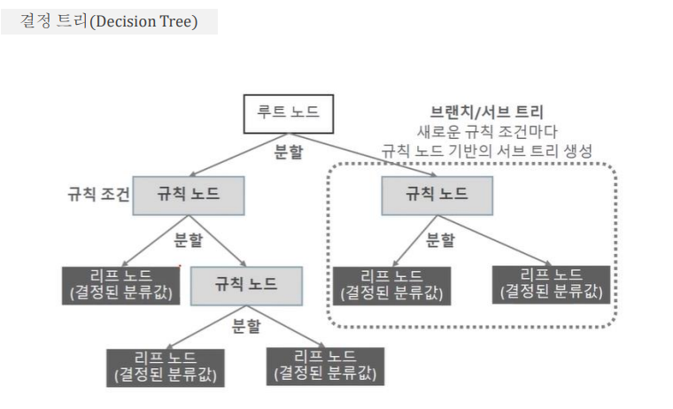

# Today I Learned

> ### 머신러닝

## 분류(classfication)

- 나이브 베이즈(Navie Bayes) : 베이즈 통계와 생성 모델에 기반 

- 로지스틱 회귀(Logistic Regression) : 독립변수와 종속변수의 선형 관계성에 기반 

- 결정 트리(Decision Tree) : 데이터 균일도에 따른 규칙 기반 

- 서포트 벡터 머신(Support Vector Machine) : 개별 클래스 간의 최대 분류 마 진을 효과적으로 찾아 줌 

- 최소근접(Nearest Neighbor) 알고리즘 : 근접 거리를 기준으로 함 

- 심층 연결 기반의 신경망(Neural Network) 

- 앙상블(Ensemble) : 서로 같거나 다른 머신러닝 알고리즘을 결합

- 결정트리

- 정보이득 (Information Gain)  

  - 엔트로피라는 개념을 기반으로 함 

  - 주어진 데이터 집합의 혼잡도

  - 서로 다른 값이 섞여 있으면 엔트로피가 높음

  - 같은 값이 섞여 있으면 엔트로피가 낮음 - 정보 이득 지수 = 1 -엔트로피 지수 

  - 정보 이득이 높은 속성을 기준으로 분할 

    

- 지니 계수

  - 경제학에서 불평등 지수를 나타낼 때 사용하는 계수

  - 0이 가장 평등하고 1로 갈수록 불평등 하다.

  - 머신러닝에서는 지니계수가 낮을 수록 데이터 균일도 가 높은것으로 해석

  - 지니계수가 낮은 속성을 기준으로 분할

- 결정트리 장점
  - 쉽다. 직관적이다.
  - 피처의 스케일링이나 정규화 등의 사전 가공 영향도가 크지않다.

- 결정트리 단점
  - 과적합으로 알고리즘 성능이 떨어진다.
  - 이를 극복하기 위해 트리의 크기를 사전에 제한하는 튜닝 필요

## 결정트리 : 주요 하이퍼 파라미터

### min_samples_split

- 노드를 분할하기 위한 최소한의 샘플 데이터 수로 과적합 제어에 사용.
- default는 2이다. 작게 설정할수록 분할되는 노드가 많아져 과적합 가능성 증가.

### min_samples_leaf

- 말단 노드가 되기위한 최소한의 샘플 수
- 과적합 제어 용도. 비대칭적 데이터의 경우 특정 클래스의 데이터가 극도로 작을 수 있어 이 경우에는 작게 설정.

### max_features

- 최적의 분할을 위해 고려할 최대 feature 개수. default는 None으로 데이터 세트의 모든 feature을 사용하여 분할.
- int로 지정 시 대상 feature 개수, float로 지정 시 전체 feature중 대상 feature의 퍼센트
- sqrt는 전체 feature중 제곱근 값.
- auto는 sqrt와 동일
- log는 전체 featur을 log2()로 선정

### max_depth

- 트리의 최대 깊이 지정
- default는 None. 이는 완벽히 클래스 결정값이 될때 까지 깊이를 계속 키우거나 노드가 가지는 데이터 개수가 `min_samples_split`보다 작아질 때 까지 계속 분할
- 깊이가 깊어지면 `min_samples_split` 설정대로 최대 분할하여 과적합할 수 있으므로 적당한 값으로 제어.

### max_leaf_nodes

- 말단 노드 최대 개수

